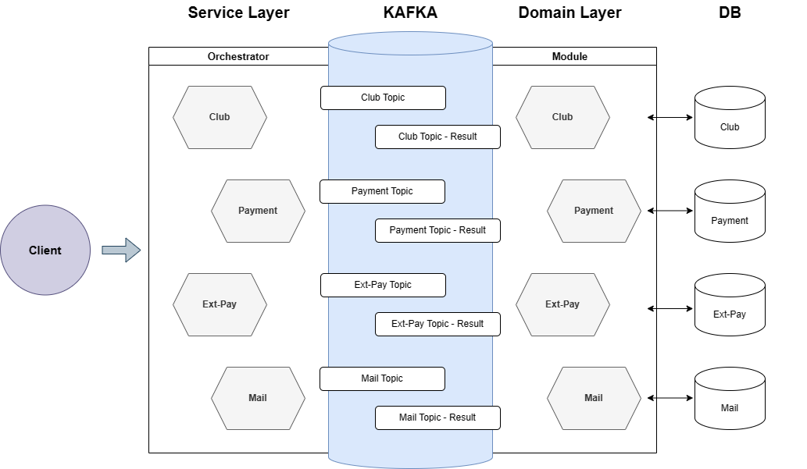
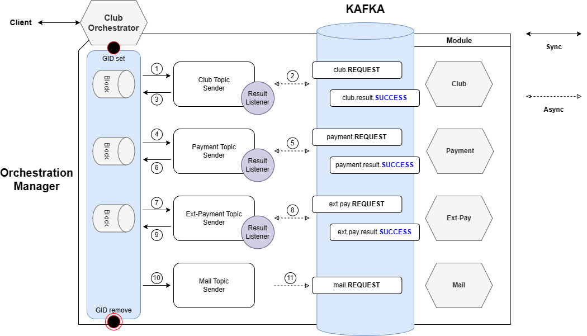
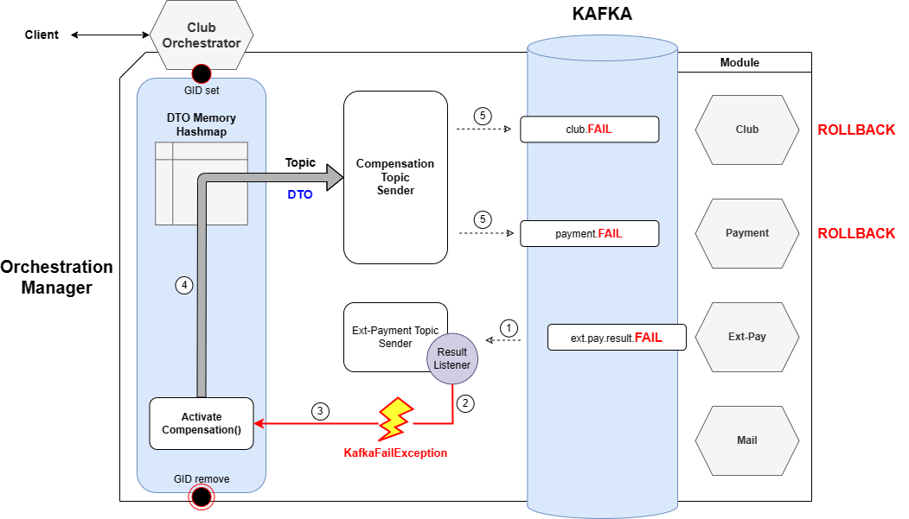

## Goal

효율적이고 지속 가능한 **MSA 애플리케이션** 개발을 위한 **SAGA 오케스트레이터 프레임워크**

---

## System Outline



동호회 플랫폼을 예시로 하며,

해당 프로젝트에서 구현된 부분은 **Club Orchestrator**

- 동일한 구성의 오케스트레이터 파드를 Payment, Ext-pay, Mail 이라는 이름으로 생성할 수 있음

---

## Layer Concept

4계층으로 구성

- Frontend - **Service Layer** - **Domain Layer** - DB

- 기존 Monolithic MVC의 **서비스 계층을 두 개로 분리**하고, 기능 간의 경계를 보다 명확히 함

### Service Layer

Controller 가 위치함으로써 Frontend와의 통신을 전담

**KafkaQueue**를 사용하여 **이벤트의 순차적 송수신과 트랜잭션 일관성을 유지**함

**오케스트레이터** 파드가 위치

### Domain Layer

Kafka 이벤트에 의해 작동하는 **무상태 API**로 고유의 Persistence를 관리

도메인 **모듈** 파드가 위치

---

## SAGA-Orchestrator Framework

Kafka 이벤트 송수신 과정에 대한 **순차 처리**, **보상트랜잭션 처리 로직** 같이

**아키텍처** 수준에서 중요하면서도 **모든 오케스트레이터가 공유하는** 기능에 대해 공통화 처리를 적용

- `OrchestrationBase` 와 `OrchestrationManager`

- 아키텍처 이해도가 낮은 개발자도 두 클래스에 의존하면 MSA 코드 작성이 가능하며, 실제 비즈니스 로직에 보다 집중할 수 있음

---

## Implementation Detail

**일반론적 측면**에 집중하여 아키텍처 구성과 실제 구현 내용에 대해 기술한다.

### Sequential & Synchronized Orchestration



#### 1. 클라이언트 최초 요청 시

오케스트레이터는 클라이언트 요청이 최초 진입할 시 GID를 생성한다.
그리고 해당 GID 에 매핑되는 두 가지 데이터를 메모리에 적재한다.

- 해당 GID 가 발송하는 Kafka event 의 Topic 과 그에 대한 BlockingQueue 를 관리하는 ConcurrentHashMap
- 해당 GID 가 발송하는 Kafka event 에서 사용했던 DTO 를 임시로 저장하고 관리하는 ConcurrentHashMap

#### 2. Kafka 이벤트 발송 메서드의 2가지 종류

Service 메서드에서는 각 모듈로 송신하는 Kafka 이벤트를 순차적으로 입력한다.
각 이벤트 발송 시, 

- 모듈로부터 응답 (*.result Topic) 이 돌아오는 것을 기다렸다가 진행할 지
- 모듈의 응답을 기다리지 않을 지를 선택할 수 있다.

#### 3. Kafka 이벤트 송수신 전 과정

모듈로부터의 응답을 기다리고자 하는 경우 다음과 같은 순서로 Kakfa 이벤트 송수신이 일어난다.

- 오케스트레이터는 A 모듈로 Topic = Test, Key = REQUEST 이벤트를 송신한다.
  그리고 해당 GID, Topic 에 해당하는 BlockingQueue 를 생성하고,
  BlockingQueue 로 결과값이 수신될 때까지 쓰레드를 정지시킨다.

- A 모듈이 그에 대한 응답으로
  Topic = Test.result, Key = SUCCESS 혹은
  Topic = Test.result, Key = FAIL  이벤트를 송신한다.

- 오케스트레이터의 Listener 클래스는 Topic=Test.result 를 수신받으면,
  해당 GID, Topic 에 해당하는 BlockingQueue 로 응답 결과를 넣는다.

- 이에 따라 BlockingQueue 로 정지시킨 쓰레드가 구동된다.

모듈로부터의 응답을 기다리지 않는 경우, 오케스트레이터는 Kafka 이벤트만 송신할 뿐 별도의 BlockingQueue 처리를 하지 않는다.

#### 4. 클라이언트 요청 반환 및 메모리 반환

모든 과정이 끝나고 클라이언트로 응답을 보낼 때, 해당 GID 와 그에 매핑되는 메모리 내 데이터를 삭제처리한다.

### Compensating Transaction for SAGA



#### DTO 메모리의 역할

Service 메서드는 보상트랜잭션을 구현하기 위해, 각 모듈로 향하는 이벤트의 DTO를 GID, Topic 에 매핑하여 메모리에 적재하게 된다. 

#### 보상트랜잭션 발생 과정

- 오케스트레이터가 A 모듈로 Topic = Test, Key = REQUEST 이벤트를 송신한 후 응답이 돌아왔을 때,

- Test.result 의 Key 가 FAIL 인 경우 KafkaFailException 을 유발한다.

- KafkaFailException이 발생한 오케스트레이터의 Service 메서드는 이후의 처리를 진행하지 못하고, 보상트랜잭션 로직으로 진입한다.

- KafkaFailException 발생 시 유발되는 보상트랜잭션 로직에서는, 
  메모리에서 해당 GID 에 매핑되는 Topic 과 DTO 를 찾아서,
  Key = FAIL 로 설정한 카프카 이벤트를 각 모듈로 송신한다.

- 이를 통해 각 모듈에서 기존에 처리된 내용들이 롤백되고,

- GID 삭제 등 공통 로직이 동작하면서 메서드가 종료한다.

---

## Development Guide

위에서 이론적으로 설명한 프레임워크의 구성을 바탕으로,

해당 프레임워크의 장점을 활용할 수 있는 **실제 개발 가이드**를 기술한다.

#### 1. 기능에 대한 Domain R&R 부여

Client 에게 표시되는 화면이나 Domain 밀접성을 기준으로, 각 기능에 R&R 이 부여된다.

- ex) 클럽 가입 신청 기능은 Club Domain 에 해당할 것

- R&R이 애매한 신규 기능은 관련 담당자들 간 협의를 거쳐 하나로 확정하고,

- 기능의 고유성이 높을 시 독자 Domain 으로 분리한다.

#### 2. 각 Domain에 대해 필요한 REST API 도출

기능을 구현하기 위해 여러 Domain 의 역할이 필요할 수 있다.

- ex) 클럽 가입 신청 시, Club -> Payment -> Ext-Payment -> Mail 순으로 서로 다른 모듈이 모두 동작해야 한다.

각 Domain 에게 필요로 하는 REST API 를 도출하여, 각 Domain의 담당자에게 개발을 요청한다.

#### 3. Domain 개발

Domain 담당자는 로컬 트랜잭션을 관리하는 REST API를 개발하고, 해당 API 에 Kafka topic 을 매칭하여 Listen 한다.

단, 이 때 담당자는 **동일한 DTO**로 동작하는 **보상거래 API**를 함께 개발하여야 한다.

#### 4. Orchestrator 개발

Orchestrator 에서는 **각 Domain 으로 향하는 Kafka event의 순차처리와 보상트랜잭션을 관리**한다.

##### 4-1. Service class / Listener class

```java
import shc.web.cluborche.dto.KafkaOrchestrationDto;
import shc.web.cluborche.exception.KafkaFailException;
import shc.web.cluborche.util.OrchestrationManager;

import java.util.Map;
import java.util.concurrent.BlockingQueue;

import static shc.web.cluborche.util.OrchestrationBase.*;

@Service
@RequiredArgsConstructor
@Slf4j
public class ClubJoinService {

    private final OrchestrationManager orchestrationManager;

    public ClubJoinRsp join(ClubJoinReq req) {
        ClubJoinRsp rsp = ClubJoinRsp.builder().gid(req.getGid()).build();
        Map<String, BlockingQueue<String>> requestQueueMap = InitiateSAGA(req.getGid());
        try {
            orchestrationManager.sendKafkaEventAndWait(
                    req.getGid(),
                    requestQueueMap,
                    KafkaOrchestrationDto.builder().topic("shc.club.join").key("REQUEST")
                            .kafkaKeyDto(KafkaKeyDto.builder().gid(req.getGid())
                                    // make input DTO
                                    .build())
                            .build());

            orchestrationManager.sendKafkaEventAndWait(
                    req.getGid(),
                    requestQueueMap,
                    KafkaOrchestrationDto.builder().topic("shc.pay").key("REQUEST")
                            .kafkaKeyDto(KafkaKeyDto.builder().gid(req.getGid())
                                    // make input DTO
                                    .build())
                            .build());

            orchestrationManager.sendKafkaEventAndWait(
                    req.getGid(),
                    requestQueueMap,
                    KafkaOrchestrationDto.builder().topic("shc.ext.payment").key("REQUEST")
                            .kafkaKeyDto(KafkaKeyDto.builder().gid(req.getGid())
                                    // make input DTO
                                    .build())
                            .build());

            orchestrationManager.sendKafkaEventAndPass(
                    req.getGid(),
                    KafkaOrchestrationDto.builder().topic("shc.sms").key("REQUEST")
                            .kafkaKeyDto(KafkaKeyDto.builder().gid(req.getGid())
                                    // make input DTO
                                    .build())
                            .build());

            rsp.setCode("200");
        } catch (KafkaFailException e) {
            orchestrationManager.activateCompensation(req.getGid());
            rsp.setCode("500");
        } finally {
            TerminateSAGA(req.getGid());
        }
        return rsp;
    }

}
```

##### 4-1-1. initiate SAGA

```java
    public static Map<String, BlockingQueue<String>> InitiateSAGA(String GID) {
        Map<String, BlockingQueue<String>> requestQueueMap = new HashMap<>();
        Map<String, KafkaOrchestrationDto> orchestrationDtoMap = new HashMap<>();

        CLUB_ORCHESTRATOR_BASE.put(GID, requestQueueMap);
        ORCHESTRATOR_DTO_MEMORY.put(GID, orchestrationDtoMap);

        log.info(">>>>>>>>>>>> INITIATE SAGA with [GID = {}]", GID);

        return requestQueueMap;
    }
```

서비스 메서드 진입 시점에 `InitiateSAGA(req.getGid())` 를 선언하여, 해당 **GID** 에 대한 트랜잭션 관리를 시작한다.

**토픽 순차처리 및 보상트랜잭션 관리**를 위한 `BlockingQueue` 를 `Map` 으로 리턴받아, 메서드 내부에서 사용한다.

##### 4-1-2. KafkaFailException에 대한 try-catch

`OrchestrationManager` 클래스는, 외부 모듈에서 돌아온 Kafka 이벤트의 결과값이 Fail인 경우 `KafkaFailException` 을 발생시킨다.

- 외부 모듈의 Fail 을 인지하는 방법은 후술한다.

토픽 순차처리는 기본적으로 `KafkaFailException` 을 `catch` 하는 `try` 블록 내부에서 이루어지기 때문에, 중간에 예외가 발생하면 이후 토픽은 **송신하지 않게 되어** 안정성을 확보한다.

#### 4-1-3. 외부 모듈에 대한 Kafka 이벤트 순차 발송

`OrchestrationManager` 는 두 가지 메서드를 제공한다.

- `sendKafkaEventAndWait()`

- `sendKafkaEventAndPass()`

Kafka 이벤트를 외부 모듈에 발송한 이후 **결과값을 기다리는지 여부**에 따라 선택적으로 활용할 수 있다.

- 기술적으로는, **`BlockingQueue` 를 이용해 Sync process 처리하는지 여부**가 결정된다.

- 두 메서드의 사용법은 유사하나, `initiateSAGA` 시점에 확보한 `requestQueueMap` 을 파라미터로 넘기는지의 여부가 다르다.

- `sendKafkaEventAndWait()` 메서드의 경우, 메시지 발송과 함께 해당 Topic을 다루는 `BlockingQueue`가 **대기 상태**에 들어가서 **응답을 기다리게 된다**.

- ```java
      public static String WaitKafkaResponse(Map<String, BlockingQueue<String>> requestQueueMap, String topic) {
          String result = "FAIL";
          try {
              log.info(">>>>>>>>>>>> Blocking Queue WAIT, [topic = {}]", topic);
              result = requestQueueMap.get(topic).take();
              log.info(">>>>>>>>>>>> Blocking Queue RESPONDED, [topic = {}, RESULT = {}]", topic, result);
          } catch (InterruptedException e) {
              throw new RuntimeException(e);
          }
          return result;
      }
  ```

- 그 응답을 받아내는 것은 아래의 **Listener 클래스**이다.

#### 4-1-4. `sendKafkaEventAndWait()` 대한 Topic 네이밍 룰과 Listener 구현

각 모듈과의 스펙을 정의할 때, 정상적인 첫번째 이벤트 발송 Key를 **REQUEST**로 통일한다.

모듈로부터 응답을 기다리고자 하는 경우, (`sendKafkaEventAndWati()` 를 사용한 경우)

발송했던 **Topic**에서 **`.result` 를 붙인 Topic을 Listening 하는 클래스**를 오케스트레이터에서 선언해야 한다.

```java
import org.springframework.kafka.annotation.KafkaListener;
import org.springframework.kafka.support.KafkaHeaders;
import org.springframework.messaging.handler.annotation.Header;
import org.springframework.messaging.handler.annotation.Payload;
import org.springframework.stereotype.Component;

import static shc.web.cluborche.util.OrchestrationBase.PushSingleBlockingQueue;

@Component
@Slf4j
public class ClubJoinListener {

    @KafkaListener(topics = "shc.club.join.result", groupId = "shc", containerFactory = "clubKafkaListenerContainerFactory")
    public void listenJoin(
            @Payload KafkaKeyDto kafkaKeyDTO,
            @Header(name = KafkaHeaders.RECEIVED_KEY, required = false) String key,
            @Header(KafkaHeaders.RECEIVED_TOPIC) String topic) throws InterruptedException {
        PushSingleBlockingQueue(kafkaKeyDTO.getGid(), topic.replaceAll("\\.result$", ""), key);
    }

    @KafkaListener(topics = "shc.pay.result", groupId = "shc", containerFactory = "clubKafkaListenerContainerFactory")
    public void listenPayment(@Payload KafkaKeyDto kafkaKeyDTO,
                              @Header(name = KafkaHeaders.RECEIVED_KEY, required = false) String key,
                              @Header(KafkaHeaders.RECEIVED_TOPIC) String topic) throws InterruptedException {
        PushSingleBlockingQueue(kafkaKeyDTO.getGid(), topic.replaceAll("\\.result$", ""), key);
    }

    @KafkaListener(topics = "shc.ext.payment.result", groupId = "shc", containerFactory = "clubKafkaListenerContainerFactory")
    public void listenExtPayment(@Payload KafkaKeyDto kafkaKeyDTO,
                              @Header(name = KafkaHeaders.RECEIVED_KEY, required = false) String key,
                              @Header(KafkaHeaders.RECEIVED_TOPIC) String topic) throws InterruptedException {
        PushSingleBlockingQueue(kafkaKeyDTO.getGid(), topic.replaceAll("\\.result$", ""), key);
    }

}
```

위 클래스는 `ClubJoinService` 에 대응하는 `ClubJoinListener`로,

대응하는 서비스 클래스에서 `sendKafkaEventAndWait()` 를 선언한 **Topic**에 대해 그 **결과를 Listening**하고 있다.

- suffix에 해당하는 `.result` 를 붙인 상태로 Topic을 Listening 하고 있다가,

- 해당 이벤트를 수신하면 결과에 해당하는 **Key**를 **원본 Topic이 대기 중인 `BlockingQueue` 에 Push** 한다.

- 이로써 서비스 클래스의 `sendKafkaEventAndWait` 는 외부 모듈의 응답을 받아낼 수 있고,

- `BlockingQueue` 에 의해 중단됐던 메서드가 다음 이벤트 송신으로 진행할 수 있다.

#### 4-1-5. 모듈 응답 이벤트의 Key 네이밍 룰

각 모듈에서는 처리 결과에 대해서 **Topic** 네이밍 룰을 지켜야하고, (위 Listener 클래스에 대응)

이에 더하여 **Key** 값에 대해서도 네이밍 룰을 지켜야 한다.

API 처리 결과가 성공인 경우 **SUCCESS**, 실패인 경우 **FAIL**을 명시적으로 리턴해야 한다.

```java
    public void sendKafkaEventAndWait(String gid, Map<String, BlockingQueue<String>> requestQueueMap, KafkaOrchestrationDto orchestrationDto) throws KafkaFailException {
        log.info(">>>>>>>>>> sendKafkaEventAnd WAIT : [TOPIC = {} , KEY = {}]", orchestrationDto.getTopic(), orchestrationDto.getKey());
        requestQueueMap.put(orchestrationDto.getTopic(), new ArrayBlockingQueue<>(1));
        kafkaTemplate.send(orchestrationDto.getTopic(), orchestrationDto.getKey(), orchestrationDto.getKafkaKeyDto());
        String result = WaitKafkaResponse(requestQueueMap, orchestrationDto.getTopic());
        if ("FAIL".equals(result)) {
            log.error(">>>>>>>>>>>>>>> COMPENSATION : [GID = {}]", gid);
            log.error(">>>>>>>>>>>>>>> Caused By : [TOPIC = {}]", orchestrationDto.getTopic());
            throw new KafkaFailException();
        }
        StoreKafkaDtoMemory(gid, orchestrationDto);
    }
```

위는 `sendKafkaEventAndWait()` 메서드로, `String result` 가 모듈의 응답에서 리턴된 **Key** 값에 해당한다.

해당 Key 값이 **FAIL**인 경우, `KafkaFailException` 을 발생시킴으로써 **서비스 메서드의 진행을 중단**시키게 된다.

#### 4-1-6. 보상트랜잭션 발생

```java
    public void activateCompensation(String gid) {
        log.warn(">>>>>>>>>> COMPENSATE START : [GID = {}]", gid);
        GetDtoMemory(gid).forEach((String topic, KafkaOrchestrationDto kafkaOrchestrationDto) -> {
            log.warn(">>>>>>>>>> COMPENSATE : [TOPIC = {}]", topic);
            sendKafkaCompensation(kafkaOrchestrationDto);
        });
    }
```

서비스 클래스는 `catch` 블록에서 `activateCompensation()` 을 호출하여 보상트랜잭션을 발생시킨다.

`OrchestrationManager`는, GID에 기반하여 메모리에서 **그동안 해당 메서드가 성공 응답을 받은 wait 이벤트에 대해 Topic과 사용한 DTO**를 로딩한다.

- `sendKafkaEventAndWait()` 메서드가 성공으로 끝나는 시점에, DTO Memory에 `put()` 하는 처리를 진행함 (`StoreKafkaDtoMemory()`)

이후 **Key** 값을 **FAIL**로 입력하여 각 모듈로 이벤트를 송신하면, 사전 규약에 의해 각 모듈에서 보상트랜잭션 API를 작동시키게 된다.

#### 4-1-7. terminate SAGA

```java
    public static void TerminateSAGA(String GID) {
        log.info(">>>>>>>>>>>> TERMINATE SAGA with [GID = {}]", GID);

        CLUB_ORCHESTRATOR_BASE.remove(GID);
        ORCHESTRATOR_DTO_MEMORY.remove(GID);
    }
```

메서드가 성공적으로 종료하면 200 코드를, Exception이 발생하면 500 코드를 리턴하며

`finally` 블록에서 `TerminateSAGA` 를 통해 **GID 삭제 및 관련된 메모리 초기화**를 진행한다.

---

## Effectiveness

#### MSA 애플리케이션 운영에 대한 안정성 향상

아키텍처 이해도가 낮은 개발자여도, SAGA 패턴에 대한 안정적인 개발이 가능함

#### 신규 기능 개발 시의 생산성 향상

SAGA 구현과 같은 아키텍처 레벨의 고민을 최소화한 가운데 비즈니스 로직에 집중하도록 함으로써, 신규 기능을 빠르게 개발할 수 있음.

---

## P. S.

개발 기간 : 2023.11.21 ~ 2023.11.26

추후 개선 과제

- 서비스 클래스 내의 `Orchestration` 관련 코드 완전 배제

- `Listener` 클래스 개선

- Kafka Topic, Key 네이밍 룰을 강제하기 위한 시스템 마련

- `Orchestration` 공통 코드 안정성 확보 (예외처리 등)

- `Orchestration` 공통 코드 Freezing 및 library packaging
